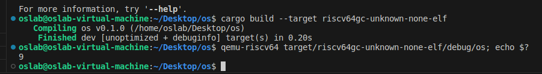
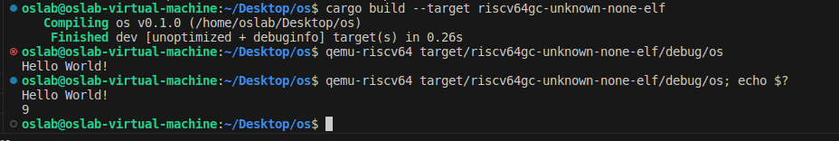
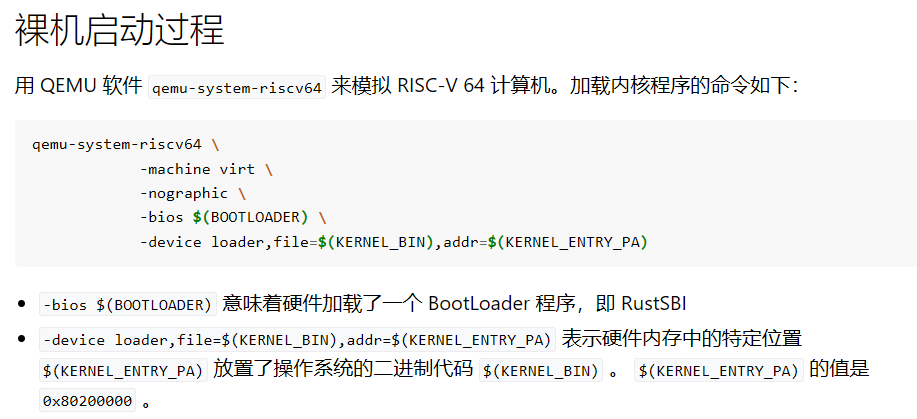
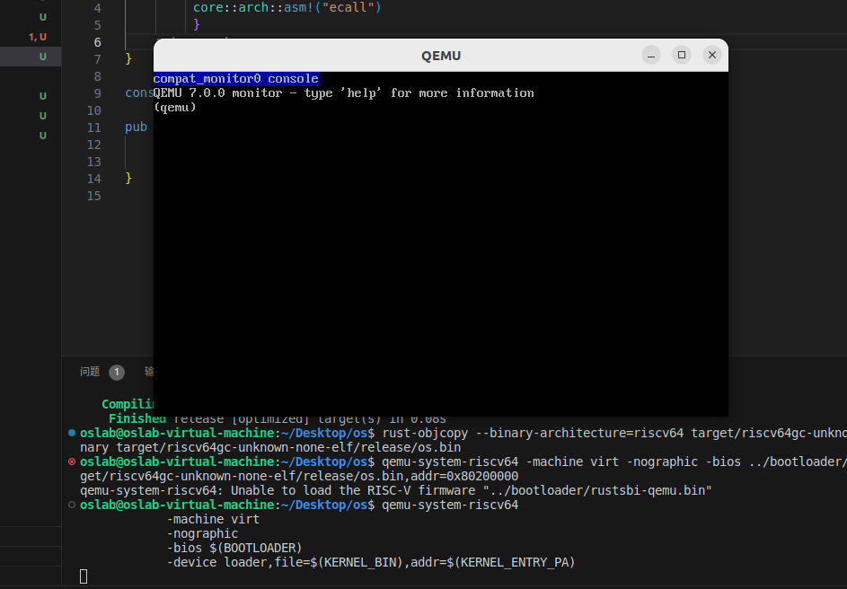

反汇编导出汇编程序：<br/>
`rust-objdump -S target/riscv64gc-unknown-none-elf/debug/os`<br/>
执行命令：<br/>
`qemu-riscv64 target/riscv64gc-unknown-none-elf/debug/os`<br/>
使用操作系统提供的 exit 系统调用来退出程序:<br>
```rust
pub fn sys_exit(xstate: i32) -> isize {
    syscall(SYSCALL_EXIT, [xstate as usize, 0, 0])
}
```
加入之后，使用`cargo build --target riscv64gc-unknown-none-elf`来编译程序<br>
然后用qemu来运行打印程序：<br>
`qemu-riscv64 target/riscv64gc-unknown-none-elf/debug/os; echo $?`
这样，我们勉强完成了一个简陋的用户态最小化执行环境。<br>

## 有显示支持的用户态执行环境
**我们可以对显示字符的基本 Trait 和数据结构、函数等的关键部分进行扩展，就可以实现定制的 println! 功能。**<br>
封装包装与实现此处代码不必展示，具体详情看：<br>
<a href="http://learningos.cn/rCore-Tutorial-Guide-2023A/chapter1/3mini-rt-usrland.html">rCore <br></a>

#### 报错：
> 1.use of undeclared crate or module `fmt`
> 2. impl Write for Stdout {
    --------- ^^^^^ not found in this scope
#### 解决方法：
> 添加如下两行代码，用来导入包：
> `use core::fmt;`
> `use core::fmt::Write;`

然后编译运行，方法同上。

## 构建裸机执行环境
有了上一节实现的用户态的最小执行环境，稍加改造，就可以完成裸机上的最小执行环境了。<br>
我们将把 Hello world! 应用程序从用户态搬到内核态。<br>
用 QEMU 软件 qemu-system-riscv64 来模拟 RISC-V 64 计算机。命令与代码见网页：<br>
<a href="http://learningos.cn/rCore-Tutorial-Guide-2023A/chapter1/4mini-rt-baremetal.html">rCore <br></a>

坏消息：运行这条指令失败，并不能顺利找到这些东西。<br>
####暂且记下，等后续处理
我又来了，可以运行了，结果如下：<br>

坏消息：后续不会操作了，操作书里也没有。<br>
#### 下面实现关机功能
对上一节实现的代码稍作调整，通过 ecall 调用 RustSBI 实现关机功能：<br>
代码省略，看网页上的，和上一个连接一样<br>
编译生成ELF格式的执行文件：`cargo build --release`<br>
把ELF执行文件转成bianary文件:<br>
`rust-objcopy --binary-architecture=riscv64 target/riscv64gc-unknown-none-elf/release/os --strip-all -O binary target/riscv64gc-unknown-none-elf/release/os.bin`<br>
加载运行:`qemu-system-riscv64 -machine virt -nographic -bios ../bootloader/rustsbi-qemu.bin -device loader,file=target/riscv64gc-unknown-none-elf/release/os.bin,addr=0x80200000`<br>
####当然后续又存在问题，详情看网页
**编译出错：**<br>
出错1：<br>
```rust
68 |     shutdown();
   |     ^^^^^^^^ not found in this scope
```
解决：<br>
> `use crate::sbi::shutdown;`

出错2：<br>
```rust
4 | /          core::arch::asm!(
5 | |              "ecall")
  | |_____________________^ expected `usize`, found `()`
  ```
解决：<br>
```rust
//参数添加下划线，删除mut并给ret赋值0，返回ret
fn sbi_call(_which: usize, _arg0: usize, _arg1: usize, _arg2: usize) -> usize {
    let ret = 0;
     unsafe {
         core::arch::asm!("ecall")
         }
    return ret;
}
```
#### 处理完后继续出错
```rust
qemu-system-riscv64: 
    Unable to load the RISC-V firmware "../bootloader/rustsbi-qemu.bin"
```
####今天先写到这里