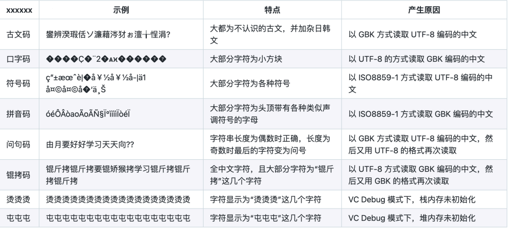

# <center> RUST 标准库
## 一、字符串
#### 1.字符串类型
* Rust的字符串处理机制比较复杂。
  * 主要是用UTF_8编码的Unicode字符序列
  * 不是空字符'\0'结尾的 C 风格字符串，可以包含空字符。
* 主要有两大类：`&str` 和 `String`。

#### 2.字符编码
* **编码**：字符在计算机内部的表示方式
* **早期**：ASCII 码，以英文字符为主，7 位二进制
* **中文**：GB 2312-1980《信息交换用汉字编码字符集》，6,763 个汉字，两个字节
  * GB 18030-2005《信息技术中文编码字符集》，70,244 个汉字，两个字节或四个字节
* **Unicode**：试图把全世界的文字都纳入进来，收集了 144,697 个字符，四个字节
  * 常用 UTF-8 的形式来表示，变长一到四个字节

#### 3.乱码问题
**<center> Unicode中文乱码速查表**</center>


#### 4.&str
* `&str` 是字符串切片，是切片的一种。
* 形如 "string literals" 的字符串字面值是 `&str` 类型的1。
* 不能用方括号来做形如 some_str[i] 的索引，因为每个 Unicode 字符可能有多个字节。
* 正确的做法是在 chars() 中迭代：
  * `for c in "1234".chars() { ... }`

#### 5.String
* String 是分配在堆上的，可以动态增长。
  * 和 Vec 类似，实际上就是在 `Vec<u8>` 外面包了一层。
* 也不能用下标来索引。
  * 可以通过 `s.chars().nth(i) `来访问某个字符。
* 通过取引用的方式可以获得 `&str`。
```rust
let s0: String = String::new();
let s1: String = "foo".to_string();
let s2: String = String::from("bar");
let and_s: &str = &s0;
```
#### 6.str
* 如果 &str 是一种字符串类型，那么 str 到底是什么？
* str 是一种 Unsized 的类型，也就是编译时大小未知。
  * 不能直接绑定 str，只能通过引用的形式来使用。

#### 7.字符串连接操作
* 可以用 + 连接一个 String 和一个 &str 类型的字符串（注意顺序）：
  ```rust
  let a = String::from("hello");
    let b = String::from(" world");
    let c = a + &b;
    // `a` is moved and can no longer be used here.
  ```
* 如果想保留第一个 String，需要做一份克隆 (clone)：
  ```rust
  let a = String::from("hello");
  let b = String::from(" world");
  let c = a.clone() + &b;
  // `a` is still valid here
  ```

  #### 8.字符串连接操作和实现
  * 如果要连接两个 &str，需要把第一个转换成 String：
  ```rust
  let a = "hello";
  let b = " world";
  let c = a.to_string() + b;
  ```
  * 连接操作的实现代码：
  ```rust
  fn add(mut self, other: &str) -> String {
    self.push_str(other);
    self
  }
  ```
#### 9.String 与 &str 并存的设计原因
* `&str` 能够提供 String 的一个视图，正如切片之于 Vec 向量那样。
* 拷贝 String 的代价非常高昂，而且借用的时候并不一定需要整个字符串。
* `&str` 提供了一种低开销传递部分 String 字符串内容的方法，而且节约内存。
* 一般而言，如果要处理字符串，使用 String，同时可以用 `&str` 来借用其中的内容。
 

## 二、Option枚举类型
#### 1.Option<<T>T>类型
```rust
enmu Option<T> {
  None,
  Some(T),
}
```
* `Option<T>`是一个枚举类型，同时也是泛型类型。
* 为某种已有类型提供了表示没有或者空值的概念。
* 在 Rust 中，在需要返回空值时，推荐使用 `Option<T>`。
  * 而不是返回诸如 NaN、-1、null 等特殊的值。
* 类型 T 可以是任何类型，没有限制。

#### 2.Option::unwrap()
* 在处理 Option 类型的数据时，一定会面对 None 的情况，忽略 None 是一种很常见的处
理办法。
```rust
// fn foo() -> Option<i32>
match foo() {
  None => (),
  Some(value) => {
    bar(value)
    // ...
  },
}
fn unwrap<T>(self) -> T {
  match self {
    None => panic!("Called `Option::unwrap()` on a `None` value"),
    Some(value) => value,
  }
}
let x = foo().unwrap();
let y = bar(x);
// ...
```
* `Option::unwrap()`在遇到None时会恐慌并输出固定的内容。
* 更好的做法是调用`expect(self, msg: &str) -> T`。
  * 它可以在遇到 None 时以指定的信息执行恐慌。

#### 3.Option::map()
* 如果希望对一个 Option 进行变换，也就是有值的时候作用一个函数，空值的时候继续保
持空值，可以调用：
```rust
fn map<U, F>(self, f: F) -> Option<U>
where F: FnOnce(T) -> U {
    match self {
      None => None,
      Some(x) => Some(f(x))
    }
}
// fn foo() -> Option<i32>
let x = foo().map(|x| bar(x));
```

#### 4.Option::and_then()
* 类似的还有and_then:
```rust
fn and_then<U, F>(self, f: F) -> Option<U>
where F: FnOnce(T) -> Option<U> {
  match self {
  Some(x) => f(x),
  None => None,
  }
}
// fn foo() -> Option<i32>
let x = foo().and_then(|x| Some(bar(x)));
```
* 注意，和map相比，f的类型从T -> U 变为T -> Option(U)。
  
#### 5.Option::unwrap_or()
* 如果对于空值的情况有合理的默认值，可以用 unwrap_or 提供。
```rust
impl<T> Option<T> {
  fn unwrap_or<T>(self, default: T) -> T {
    match self {
      None => default,
      Some(value) => value,
    }
  }
}
```
#### 6.Option::unwrap_or_else()
* 如果默认值由闭包计算而来，则使用 unwrap_or_else。
```rust
impl<T> Option<T> {
  fn unwrap_or_else<T>(self, f: F) -> T
  where F: FnOnce() -> T {
    match self {
    None => f(),
    Some(value) => value,
    }
  }
}
```
#### 7.其他方法
* `fn is_some(&self) -> bool`
* `fn is_none(&self) -> bool`
* `fn map_or<U, F>(self, default: U, f: F) -> U`
  * `where F: FnOnce(T) -> U`
  * U 类型的默认值
* `fn map_or_else<U, D, F>(self, default: D, f: F) -> U`
  * `where D: FnOnce() -> U, F: FnOnce(T) -> U`
  * D 类型的闭包用于计算默认值
* `fn ok_or(self, err: E) -> Result<T, E>`
* `fn ok_or_else(self, default: F) -> Result<T, E>`
  * `where F: FnOnce() -> E`
  * 与 unwrap_or 相似，用于错误处理。
* `fn and<U>(self, optb: Option<U>) -> Option<U>`
  * 如果 self 是 None，则返回 None，否则返回 optb。
* `fn or(self, optb: Option<T>) -> Option<T>`
  * 如果 self 是 Some(_)，则返回 self，否则返回 optb。
* `fn xor(self, optb: Option<T>) -> Option<T>`
  * 如果 self 和 optb 恰好有一个是 Some(_)，则返回这个 Some，否则返回 None。

#### 8.Option 例子
```rust
fn divide(numerator: f64, denominator: f64) -> Option<f64> {
  if denominator == 0.0 {
    None
  } else {
    Some(numerator / denominator)
  }
}

// The return value of the function is an option
let result = divide(2.0, 3.0);

// Pattern match to retrieve the value
match result {
  // The division was valid
  Some(x) => println!("Result: {x}"),
  // The division was invalid
  None => println!("Cannot divide by 0"),
}
```
## 三、错误处理
#### 1.Rust 的错误处理机制
* 对于不可恢复的错误，使用恐慌 panic!。
  * 数组越界、栈越界、算术运算溢出……
* 对于可恢复的错误，使用 Result。
  * 文件操作、网络操作、字符串解析……
  
#### 2.Result<T, E>
```rust
enum Result<T, E> {
  Ok(T),
  Err(E)
}
```
* Result 与 Option 类似，除了正常结果外，还可以表示错误状态。
* 也定义了 `unwrap` 和 `expect `等方法。
* 可以通过 ok 或 err 等方法转换成 Option。
  * 把 Ok 或者 Err 的值作为 Some，另一种变成 None。
* 也可以进行类似 Option 的操作。
  * and、or、……

#### 3.Result<T, E> 的处理原则
* 对于返回结果是 Result 的函数，一定要显式进行处理。
  * 可以使用 `unwrap/expect`，也可以通过匹配合理地处理 Ok/Err 状态。
  * 如果不处理，编译器会发出警告。
  * 不正确处理可能会带来潜在问题，导致意想不到的情况。

#### 4.自定义 Result 别名
* 一种常见的做法是在自己编写的库里使用自定义的错误类型，并定义 Result 的别名。
```rust
use std::io::Error;

type Result<T> = Result<T, Error>;
```
* 除了固定 E = Error 以外与 std::Result 是等价的。
* 使用的时候要注意名字空间。
```RUST
use std::io;

fn foo() -> io::Result {
  // ...
}
```
#### 5.? 操作符
* 配合 Result 类型
```RUST
fn read_username_from_file() -> Result<String, io::Error> {
  let mut username = String::new();
  File::open("hello.txt")?.read_to_string(&mut username)?;
  Ok(username)
}
```
* 配合 Option 类型
```rust
fn last_char_of_first_line(text: &str) -> Option<char> {
  text.lines().next()?.chars().last()
}
```
#### 6.? 操作符的原理
* 作用：提前传播错误
* 场合：返回值是 Result 或者 Option 函数中
* 对于 Result 类型，
  * 如果是 Err 则提前返回，当前函数立即返回该错误。
  * 否则，从 Ok 中取出返回值作为 ? 操作符的结果。
* 对于 Option 类型，
  * 如果是 None 则提前返回，当前函数立即返回 None。
  * 否则，从 Some 中取出返回值作为 ? 操作符的结果。

#### 7.错误处理的原则
* 恐慌，还是不恐慌？是否要给调用代码恢复的机会。
* 用 unwrap/expect 的场合：
  * unwrap/expect 可以作为原型代码中的错误处理占位符。
  * 当用户有更多的信息，能够保证调用不出错。
* 原则：错误发生后程序是否进入一个坏的状态？
  * 坏的状态是指不经常出现的情况，而不是像用户输入不合法这样经常可能出现的情况。
  * 之后的代码会依赖程序不处于坏的状态，而不是每一步都去检查状态。
  * 没有办法用目前使用的类型来表示这种信息。

## 四、容器
#### 1.Vec<T<T>>
* 连续空间、可增长的序列，末尾可以高效增删
* 会发生增长和收缩
* 最常用的容器

#### 2.VecDeque<T<T>>
* 双端向量，两端可以高效增删
* 用环状缓冲区来实现

#### 3.LinkedList<T<T>>
* 双向链表
* 不能随机索引

#### 4.HashMap<K,V>/BTreeMap<K,V>
* 映射/字典类型
* 一般使用 `HashMap<K, V>`
  * 需要满足 K: Hash + Eq
  * 使用哈希表实现，没有顺序，效率较高，𝑂(1) 的访存复杂度
* 需要有序的时候用 `BTreeMap<K, V>`
  * 需要满足 K: Ord
  * 使用 B 树实现，有序，效率相对低一些，𝑂(log 𝑛) 的访存复杂度

#### 5.创建新的哈希表
```rust
use std::collections::HashMap;

let mut scores = HashMap::new();

scores.insert(String::from("Blue"), 10);
scores.insert(String::from("Yellow"), 50);
```
#### 6.访问哈希表的元素
```rust
let mut scores = HashMap::new();

scores.insert(String::from("Blue"), 10);
scores.insert(String::from("Yellow"), 50);

let team_name = String::from("Blue");
let score = scores.get(&team_name);
```
#### 7.迭代哈希表
```rust
let mut scores = HashMap::new();

scores.insert(String::from("Blue"), 10);
scores.insert(String::from("Yellow"), 50);

for (key, value) in &scores {
println!("{}: {}", key, value);
}
```
#### 8.哈希表和所有权
* 对于 Copy 类型，拷贝进哈希表。
* 对于非 Copy 类型，移动进哈希表，哈希表拥有所有权。
```rust
let field_name = String::from("Favorite color");
let field_value = String::from("Blue");

let mut map = HashMap::new();
map.insert(field_name, field_value);
// field_name and field_value are invalid at this point, try using
// them and see what compiler error you get!
```
#### 9.更新哈希表
* 改写
```rust
scores.insert(String::from("Blue"), 10);
```
* 不存在时添加
```rust
scores.entry(String::from("Blue")).or_insert(50);
```
* 基于旧值更新
```rust
let text = "hello world wonderful world";
let mut map = HashMap::new();
for word in text.split_whitespace() {
  let count = map.entry(word).or_insert(0);
  *count += 1;
}
```
#### 10.HashSet<T<T>>/BTreeSet<T<T>>
* 集合，元素是唯一的
* `HashSet<T>` 和`BTreeSet<T> `就是在 `HashMap<T, ()> `和 `BTreeMap<T, ()> `上
包了一层。
* 需求和表现跟相应的 Map 相同。

#### 11.BinaryHeap<T<T>>
* 用二叉最大堆实现的优先级队列
* 弹出元素时返回目前堆中的最大值
  
## 五、迭代器
#### 1.迭代器的定义
```rust
pub trait Iterator {
  type Item;
  fn next(&mut self) -> Option<Self::Item>;
  // More fields omitted
}
```
* 迭代器特型包含一个相关的类型 Item，以及会产生该类型对象的方法 next。
* 其他方法（包括消费者和适配器）有使用 next 的默认实现版本。

#### 2.迭代器与所有权
* 有三种迭代类型：
  * `into_iter()`，产生 T 类型。
  * `iter()`，产生 &T 类型。
  * `iter_mut()`，产生 &mut T。
* 集合可以提供部分或者全部接口。  

#### 3.迭代器与循环
* 迭代器与 for ... in ... 循环的语法糖，for x in values 会展开为：
```rust
let values = vec![1, 2, 3, 4, 5];
{
  let result = match values.into_iter() {
    mut iter => loop {
      match iter.next() {
        Some(x) => { /* loop body */ },
        None => break,
      }
    },
  };
  result
}
```
#### 4.迭代器的类型转换操作
* 迭代器的处理器接受 `Iterator`，返回其他类型。
  * 例如，`map` 返回 Map，`filter` 返回 Filter。
* 这些类型也是实现了 Iterator 的结构体。
  * 不用太纠结它们的内部结构。
* 类型转换主要用于确保类型安全。

#### 5.collect
* `collect()` 把（惰性的）迭代器变成一个实际的集合。
* `collect()` 有时候需要提供类型提示来通过编译。
  * 结果可以是任何的集合（或者容器）。
```rust
fn collect<B>(self) -> B where B: FromIterator<Self::Item>

let vs = vec![1, 2, 3, 4];
// Error: What type is this? It cannot infer!
let set = vs.iter().collect();
// Hint to `collect` that we want a HashSet back.
// Note the lack of an explicit <&i32>.
let set: HashSet<_> = vs.iter().collect();
// Alternate syntax! The "turbofish" ::<>
let set = vs.iter().collect::<HashSet<_>>();
```
#### 6.fold
```rust
fn fold<B, F>(self, init: B, f: F) -> B
  where F: FnMut(B, Self::Item) -> B;

let vs = vec![1, 2, 3, 4, 5];
let sum = vs.iter().fold(0, |acc, &x| acc + x);
assert_eq!(sum, 15);
```
* fold 把迭代器折叠成一个单一的值。
  * 在其他语言或者系统里也称为 reduce 或 inject 操作。
* fold 有两个参数：
  * 初始值，或者积累值，B 类型的 acc
  * 一个“折叠”函数，参数是一个 B 类型和一个 Item 类型，返回值是 B 类型。

#### 7.filter
```rust
fn filter<P>(self, predicate: P) -> Filter<Self, P>
  where P: FnMut(&Self::Item) -> bool;
```
* filter 接受一个谓词函数 P，把不符合谓词的元素都去掉。
* filter 返回 Filter<Self, P>，需要用 collect 获得集合。

#### 8.find 和 position
```rust
fn find<P>(&mut self, predicate: P) -> Option<Self::Item>
  where P: FnMut(Self::Item) -> bool;

fn position<P>(&mut self, predicate: P) -> Option<usize>
  where P: FnMut(Self::Item) -> bool;
```
* 找出迭代器中第一个满足谓词函数 predicate 的项目。
  * `find` 返回项目本身。
  * `position`返回项目的索引。
* 没找到都返回 None。

#### 9.skip
```rust
fn skip(self, n: usize) -> Skip<Self>;
```
* 返回一个新的迭代器，跳过前 n 个元素。

#### 10.zip
```rust
fn zip<U>(self, other: U) -> Zip<Self, U::IntoIter>
  where U: IntoIterator;
```
* 把两个迭代器逐项合并成一个新的迭代器。
* 调用形式：a.iter().zip(b.iter())
  * 返回项目的形式：(ai, bi)
* 当一个输入迭代器结束时，整个 zip 输出的迭代器结束。
#### 11.any & all
```rust
fn any<F>(&mut self, f: F) -> bool
  where F: FnMut(Self::Item) -> bool;

fn all<F>(&mut self, f: F) -> bool
  where F: FnMut(Self::Item) -> bool;
```
* any 测试是否迭代器中的存在元素符合输入函数。
* all 测试是否迭代器中的所有所愿都符合输入函数。
* 逻辑或和逻辑与的关系

#### 12.enumerate
```rust
fn enumerate(self) -> Enumerate<Self>;
```
* 用于迭代集合时同时需要项目和索引。
* 返回 (index, value) 的迭代器，index 是 usize 类型的索引。
  
#### 13.迭代器适配
* 适配器 (adapters) 操作一个迭代器，返回另一个迭代器。
* 适配器通常是**惰性的**：除非不得不做，不然先不去求值。
* 必须显式使用或者用 for 循环迭代才会去求值。

#### 14.map
```rust
fn map<B, F>(self, f: F) -> Map<Self, F>
  where F: FnMut(Self::Item) -> B;

let vs = vec![1, 2, 3, 4, 5];
let twice_vs: Vec<_> = vs.iter().map(|x| x * 2).collect();
```
* map 接受一个函数，创建一个迭代器，在每个元素上调用这个函数。
* 完成从集合 `Collection<A>` 和 A -> B 函数得到 `Collection<B>` 的操作。
  * 这里，Collection 不是一种实际的类型。
  
#### 15.take 和 take_while
```rust
fn take(self, n: usize) -> Take<Self>;

fn take_while<P>(self, predicate: P) -> TakeWhile<Self, P>
  where P: FnMut(&Self::Item) -> bool;
```
* take 创建一个迭代器，返回前 n 个元素。
* take_while 接受一个谓词，迭代直到谓词返回 false。
* 可以在无限范围上使用得到有限序列：
```rust
for i in (0..).take(5) {
  println!("{}", i); // Prints 0 1 2 3 4
}
```
#### 16.cloned
```rust
fn cloned<'a, T>(self) -> Cloned<Self>
  where T: 'a + Clone, Self: Iterator<Item=&'a T>;
```
* 创建一个迭代器，在每个元素上调用 clone 方法。
* 相当于 vs.iter().map(|v| v.clone())。
* 在目前有 &T 迭代器，想有 T 迭代器的时候使用。
  
## 六、自动测试
#### 1.测试函数
单元测试是很常见且必要的功能，因此 Rust 自带了测试的支持。
                                  
Rust 中用函数来实现单元测试，函数前面加上 `#[test]` 标注这是一个测试函数：
```rust
#[test]
fn it_works() {
  let result = 2 + 2;
  assert_eq!(result, 4);
}
```
#### 2.运行测试
为了运行项目中的所有测试函数，可以用 cargo test 命令：
```rust
$ cargo test
running 1 test
test tests::it_works ... ok

test result: ok. 1 passed; 0 failed; 0 ignored; 0 measured; 0 filtered out;
finished in 0.00s
```
它会汇报每个测试的结果，并最后给出所有测试通过情况的统计信息。

#### 3.编写测试
为了确认程序行为符合预期，一般可以用如下的方式进行检查：
* assert!() 宏，断言一个值一定是 true
* assert_eq!() 宏，断言两个值一定相等
* Option::unwrap 或 Option::expect，断言一个 Option 类型的值一定是 Some(_)
```rust
#[test]
fn it_works() {
  let result = 2 + 2;
  assert_eq!(result, 4);
}
```
在测试函数中出现的panic 会被捕捉下来，并标记当前测试失败，而不会退出程序。
#### 4.测试例子
通常会把单元测试与被测试的代码放在同一个文件中：
```rust
fn vector_length(data: &Vec<i32>) -> usize {
  vector_length.len()
}

#[test]
fn test_vector_length() {
  assert_eq!(vector_length(&vec![1, 2, 3]), 3);
}
```
养成良好的习惯：每写一个函数，就在文件后面实现对它的单元测试。

#### 5.测试例子（子模块）
有时候，我们会希望测试代码仅在测试模式下编译，这样不会拖累正常编译的时间。此时可以使用 `#[cfg(test)]` 实现条件编译：
```rust
fn vector_length(data: &Vec<i32>) -> usize { vector_length.len() }

#[cfg(test)]
mod tests {
  use super::vector_length;

  #[test]
  fn test_vector_length() {
    assert_eq!(vector_length(&vec![1, 2, 3]), 3);
  }
}
```
#### 6.更多测试选项
默认情况下，`cargo test` 会同时运行多个测试以加快速度。如果你的测试在同时运行的情况
下可能出错，或者希望它按顺序执行，那么可以使用 `cargo test----test-threads=1`命令来指定它同时只进行一个测试。

如果想要指定只运行单个测试，可以使用 cargo test -- test_2 命令来仅运行 test_2 这个测试：
```rust
#[test]
fn test_1() { }

#[test]
fn test_2() { }
```
#### 7.持续集成测试
大作业仓库配置了持续集成测试，每次 Git Push 都会在云端自动执行一次 cargo test：
```rust
test:
  image: jiegec/rust:1.63-bullseye-tuna
  script:
    - cargo build
    - cargo test -- --test-threads=1
```
