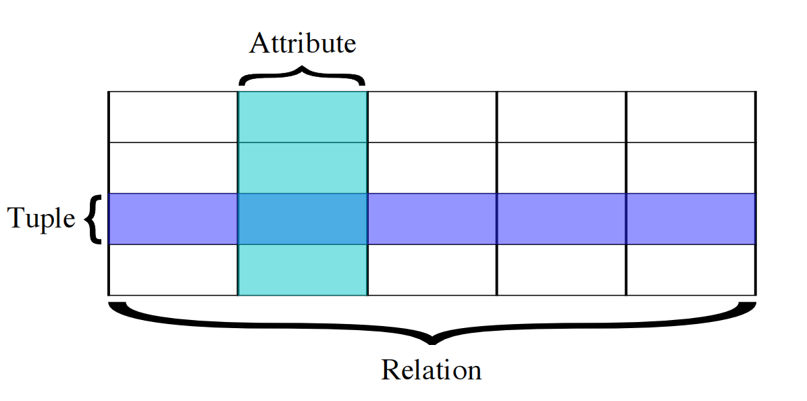

## <center> 项目管理与常用库 </center>
## 一、项目管理
#### 1.项目管理的需求
* 随着项目变大，参与者变多，组织代码的方式会越来越重要。
* 封装可以隐藏实现细节，使用户更好地复用代码。
* 名字的作用域管理是需要支持的核心功能。

#### 2.Rust 的模块系统
* **包 (packages)**：Cargo 的一项功能，可以让用户构建、测试、分享箱。
* **箱 (crates)**：也叫单元包，是由模块构成的一棵树，能够产生一个库或者可执行文件。
* **模块 (modules)**：与 use 配合，控制路径的组织结构、作用域和访问权限。
* **路径 (paths)**：命名项目的方式，这里的项目可以指结构体、函数、模块等。

#### 3.模块
* Rust 中所有项目的作用域都是基于模块的。
  * 如果不是 pub，那么只能在同一模块中访问。
  * 如果是 pub，那么可以在其他模块中访问。
* 可以在同一源代码文件中定义多个模块：
```rust
mod english {
    pub mod greetings { /* ... */ }
    pub mod farewells { /* ... */ }
}

mod chinese {
    pub mod greetings { /* ... */ }
    pub mod farewells { /* ... */ }
}
```
#### 4.写成文件的模块
```rust
mod english {
    pub mod greetings { /* ... */ }
}
```
* 可以把模块写成单独的文件：
* lib.rs:
  ```rust
  mod english;
  ```
* english.rs:
  ```rust
  pub mod greetings { /* ... */ }
  ```

#### 5.写成目录的模块
```rust
mod english {
    pub mod greetings { /* ... */ }
}
```
* 也可以用目录来组织模块：
* lib.rs:
  ```rust
  mod english;
  ```
* english/
  * mod.rs:
    ```rust
    pub mod greetings;
    ```
  * greetings.rs:
    ```rust
    /* ... */
    ```
#### 6.名字空间机制：相对
* 当访问模块的成员时，默认的名字空间相对于当前模块：
```rust
mod one {
    mod two { pub fn foo() {} }
    fn bar() {
        two::foo()
    }
}
```
#### 7.名字空间机制：绝对
```rust
mod one {
    mod two { pub fn foo() {} }
    fn bar() {
        ::one::two::foo()
    }
}
```
#### 8.通过 use 使用模块
* use 的规则与模块中的名字空间规则相反。
* 默认情况下，use 命令后面跟着的名字是绝对的。
```rust
use english::greetings;
```
* 可以使用 self 或 super 来指定相对于当前模块的名字：
```rust
// english/mod.rs
use self::greetings;
use super::chinese;
```
#### 9.重新导出
* 可以使用 pub use 来重新导出其他模块中的项目：
```rust
// default_language.rs

#[cfg(english)]
pub use english::*;

#[cfg(chinese)]
pub use chinese::*;
```
#### 10.创建自己的箱
* 对于一个库箱 (library crate) 来说，在顶层模块 (root module) 中导出的项目是该相对外
暴露的内容。
* 也就是在 lib.rs 中有 pub 标注的项目。
```rust
pub mod english;
```
#### 11.使用自己写的箱
* 可以在 Cargo 中使用自己写的箱：
```rust
[dependencies]
myfoo = { git = "https://github.com/me/foo-rs" }
mybar = { path = "../rust-bar" }
```
* 或者：
```rust
[dependencies.myfoo]
git = "https://github.com/me/foo-rs"
```
* 然后就可以使用了：
```rust
use myfoo::english;
```
#### 12.Cargo：生成多个可执行文件
* 一个包里可以同时包含库箱 (lib crate) 和二进制（可执行文件）箱 (bin crate)。
* 一般来说，库箱会包含导出项目，而二进制箱不会。
* （以下路径均相对于包所在的目录）
* Cargo 允许一个包里同时出现 `src/lib.rs` 和 `src/main.rs`。
  * Cargo 还会构建`src/bin/*.rs`，作为可执行文件。
* 示例代码放在 `examples/*.rs`。
  * 会在 `cargo test` 的时候构建，保证示例代码可以通过编译。
  * 可以用 `cargo run --example foo` 来运行。
* 集成测试（非单元测试）放在 `tests/*.rs`，用来测试正确性。
* 基准测试程序 (benchmarks) 放在 `benches/*.rs`，用来测试性能。

#### 13.Cargo：特性
* 箱的特性 (features) 可以在构建时做选择性的开关。
  * `cargo build --features using-html9`
```rust
# [package] ...
[features]
# Enable default dependencies: require web-vortal *feature*
default = ["web-vortal"]
# Extra feature; now we can use #[cfg(feature = "web-vortal")]
web-vortal = []
# Also require h9rbs-js *crate* with its commodore64 feature.
using-html9 = ["h9rbs-js/commodore64"]
[dependencies]
# Optional dependency can be enabled by either:
# (a) feature dependencies or (b) extern crate h9rbs_js.
h9rbs-js = { optional = "true" }
```
#### 14.Cargo：构建脚本
* 如果遇到超过 Cargo 所提供的功能的特殊需求，可以通过构建脚本 (build scripts) 来实
现。
  * 构建脚本也是用 Rust 语言编写的。
```rust
[package]
build = "build.rs"
```
* 之后，`cargo build` 会先编译并运行 build.rs。

#### 15.Cargo：更多功能
* 把自己写的软件包发布到 Crates.io 上。
* 创建工作空间 (workspaces)，组织多个包协同开发。
* 用 `cargo install` 从 Crates.io 上安装二进制文件。
* 通过 cargo-<command> 来扩展功能。
* Cargo 提供了很多有用的功能，详见 The Cargo Book。

## 二、语法补充
#### 1.属性
* 属性 (attributes) 是 Rust 代码给编译器传递信息的机制。
* `#[test]` 属性用于将函数标注为测试用例。
* `#[test]` 标注下一个代码段，`#![test]` 标注所在的代码段。
```rust
#[test]
fn midterm1() {
    // ...
}
fn midterm2() {
    #![test]
    // ...
}
```
#### 2.常见属性
* 常见属性有：
* `#![no_std]` 禁用标准库。
* `#[derive(Debug)]` 自动获得特型。
* `#[inline(always)]` 提示编译器的内联优化行为。
* `#[allow(missing_docs)]` 屏蔽编译器的某些警告。
* `#![crate_type = "lib"]` 提供箱的元数据。
* `#![feature(box_syntax)]` 启用不稳定版本的语法。
* `#[cfg(target_os = "linux")]` 定义条件编译。

#### 3.操作符
* 操作符的优先级顺序如下：
    * 单目操作符：! - * & &mut
    * 类型转换：as
    * 乘法类：* / %
    * 加法类：+ -
    * 位移类：<< >>
    * 按位与：&
    * 按位异或：^
    * 按位或：|
    * 比较类：== != < > <= >=
    * 逻辑与：&&
    * 逻辑或：||
    * 赋值与范围：= ..
* 此外还有函数调用 () 和下标索引 []。

#### 4.操作符重载
* Rust 使用特型来重载操作符，定义在 std::ops 下。
    * Neg, Not, Deref, DerefMut
    * Mul, Div, Mod
    * Add, Sub
    * Shl, Shr
    * BitAnd
    * BitXor
    * BitOr
    * Eq, PartialEq, Ord, PartialOrd
    * And
    * Or
* 此外还有：Fn, FnMut, FnOnce, Index, IndexMut

#### 5.类型转换
* as 操作符不能重载。
* 使用 From 和 Into 实现自定义类型转换。
    * `trait From<T> { fn from(T) -> Self; }`，调用形式为 `Y::from(x)`。
    * `trait Into<T> { fn into(self) -> T; }`，调用形式为 `x.into()`。
* 如果实现了 From，则 Into 会自动实现。建议优先实现 From。
    * 也就是说，`From<T> for U `蕴含 `Into<U> for T`。
```rust
struct A(Vec<i32>);
impl From<Vec<i32>> for A {
    fn from(v: Vec<i32>) -> Self {
        A(v)
    }
}
```
#### 6.类型转换的特殊情况
* 有时候无法实现 From，只能通过 Into 来实现。
```rust
struct A(Vec<i32>);

impl From<A> for Vec<i32> { // error: private type A in
    fn from(a: A) -> Self { // exported type signature.
        let A(v) = a; v     // (This impl is exported because
    }                       // both the trait (From) and the type
}                           // (Vec) are visible from outside.)

impl Into<Vec<i32>> for A {
    fn into(self) -> Vec<i32> {
        let A(v) = self; v
    }
}
```
#### 7.命名规范
* Rust 对标识符的命名规范：
    * CamelCase：类型、特型
    * snake_case：箱、模块、函数、方法、变量
    * SCREAMING_SNAKE_CASE：常量和静态变量
    * T（单个大写字母）：类型参数
    * 'a（撇 + 短的小写名字）：生命周期参数
* 构造函数和转换函数的命名规范：
    * new, new_with_stuff：构造函数
    * from_foo：转换构造函数
    * as_foo：低开销非消耗性转换
    * to_foo：高开销非消耗性转换
    * into_foo：消耗性转换

## 三、智能指针
#### 1.&T 和 &mut T
* 基本的、经济型的引用
* 无运行时开销，所有检查在编译时完成。
* 具有固定的生命周期，没有灵活性。
* 如果可以的话，尽量使用引用。

#### 2.Box<<T>T>
* Box<T> 用于在堆上分配空间存放数据。
* Box<T> 拥有 T 类型的对象，它的指针是唯一的（类似 C++ 的 std::unique_ptr），不能创建别名（可以借用）。
* 当 Box<T> 超过作用域时，对象自动释放。
* 使用方法和不加 Box<T> 的一般类型差不多，主要区别是动态分配。
* 通过 `Box::new()` 来创建。
```rust
let boxed_five = Box::new(5);
```
#### 3.Box<<T>T> 的特点
* 优点：
    * 是使用堆的最简单的办法。
    * 是动态分配的零开销抽象。
    * 借用和移动语义同样适用。
    * 自动销毁。
* 缺点：
    * Box 严格拥有里面的 T 类型的对象，是唯一的所有者。
    * 如果有引用的话，Box 本身必须存活到所有引用失效之后。

#### 4.std::rc::Rc<<T>T>
* Rc<T> 是共享所有权的指针类型，相当于 C++ 中的 `std::shared_ptr`。
* 是“Reference Counted”的缩写，记录指针的别名个数。
* 调用 Rc 的 `clone()` 方法来获得新的引用。
    * 会增加引用计数。
    * 不会拷贝数据。
* 当引用计数降为 0 时，会释放对象。
* T 的值只有在引用计数为 1 时才能修改，与 Rust 的借用规则一致。
```rust
let mut shared = Rc::new(6);
println!("{:?}", Rc::get_mut(&mut shared)); // ==> Some(6)
let mut cloned = shared.clone(); // ==> Another reference to same data
println!("{:?}", Rc::get_mut(&mut shared)); // ==> None
println!("{:?}", Rc::get_mut(&mut cloned)); // ==> None
```
#### 5.std::rc::Weak<<T>T>
* 当有环时，引用计数会发生问题，例如：
    * A 有一个 B 的 Rc，B 也有一个 A 的 Rc，两者的引用计数都是 1。
    * 由于构成了环，两个对象都不会被释放，从而引起内存泄露。
* 可以通过引入弱引用来避免。
    * 弱引用不会增加强引用的计数。
    * 这也表示弱引用不一定总是有效的。
* Rc 可以通过 Rc::downgrade() 降级成 Weak。
    * 需要访问时，使用 weak.upgrade() -> Option<Rc<T>> 再升级回 Rc。
    * 除此之外，Weak 干不了别的事情，通过升级步骤避免使用无效状态。
#### 6.强引用和弱引用
* 一般情况下，使用的时候需要通过 Rc 获得强引用。
* 如果应用场景中需要访问数据而没有所有权，就需要用到 Weak。
    * Weak 升级时可能会得到 None，需要应对这种情况。
* 引用成环的情况也需要用 Weak 来避免内存泄露。
    * 由于可变性规则，Rc 的环在 Rust 中很难形成。

#### 7.std::rc::Rc<<T>T> 的特点
* 优点：
    * 允许共享数据的所有权。
* 缺点：
    * 有一定的运行时开销。
        * 维护两个引用计数（强和弱）。
        * 需要动态更新和检查引用计数。
    * 引用成环会造成内存泄露。

#### 8.Cell 和 RefCell
* 允许内部可变性的机制。
* 通过不可变引用实现修改所含值的操作。
* 有两种类型的格子 (cells)：`Cell<T>` 和 `RefCell<T>`。
```rust
struct Foo {
    x: Cell<i32>,
    y: RefCell<u32>,
}
```
#### 9.std::cell::Cell<<T>T>
* 为 Copy 类型提供内部可变性的格子类型。
* 用 get() 从 Cell 中取值。
* 用 set() 更新 Cell 中的值。
    * 不能修改 T 的值，只能整个替换。
* 作用比较受限，但是安全、低开销。
```rust
let c = Cell::new(10);
c.set(20);
println!("{}", c.get()); // 20
```
#### 10.std::cell::Cell<<T>T> 的特点
* 优点：
    * 实现内部可变性。
    * 没有运行时开销。
    * 额外空间开销较小。
* 缺点：
    * 较为受限，只能用于 Copy 类型。

#### 11.std::cell::RefCell<<T>T>
* 可以为任意类型提供内部可变性的格子类型。
* 使用动态借用检查规则，在运行时进行。
    * 有可能会引起运行时的恐慌。
* 通过 borrow() 或 borrow_mut() 来借用内部数据。
    * 如果 RefCell 已经被借用，可能会引起恐慌。
```rust
use std::cell::RefCell;

let refc = RefCell::new(vec![12]);
let mut inner = refc.borrow_mut();
inner.push(24);
println!("{:?}", *inner); // [12, 24]

let inner2 = refc.borrow();
// ==> Panics since refc is already borrow_mut'd!
```
#### 12.std::cell::RefCell<<T>T> 的常见用法
* RefCell 的常见用法是把它放在 Rc 里，这样可以允许共享的可变性。
* 这样做不是线程安全的，borrow() 等方法不能防止数据竞争。
* 可以使用 `try_borrow()` 等方法来检查借用是否成功。

#### 13.std::cell::RefCell<<T>T> 的特点
* 优点：
    * 为任意类型提供内部可变性
* 缺点：
    * 要保存额外的借用状态。
    * 要在借用时检查状态。
    * 有可能会引起恐慌。
    * 不是线程安全的。

#### 14.std::cell::Ref<<T>T> 和 RefMut<<T>T>
* 当 borrow() 一个 RefCell<T> 时，得到的是 Ref<T>，而不是 &T。
    * 同样的，borrow_mut() 返回 RefMut<T>。
* Ref 和 RefMut 包装了普通的引用，提供一些额外的方法。

#### 15.*const T 和 *mut T
* 像 C 语言一样的裸指针，只是指向内存中的某个地址。
* 没有所有权规则，没有生命周期规则。
* 零抽象代价，因为没有抽象。
* 解引用时需要 unsafe，可能会引起不安全的后果。
* 可以在编写底层代码时使用（例如维护 Vec<T> 的内部状态），一般不用。
    * 使用得当可以避免运行时代价。

#### 16.自动解引用
* Rust 在大多数情况下会对变量做自动解引用操作。
    * 在对一个引用进行方法调用的时候。
    * 将引用作为函数参数进行传递的时候。
```rust
/// `length` only needs `vector` temporarily, so it is borrowed.
fn length(vec_ref: &&Vec<i32>) -> usize {
    // vec_ref is auto-dereferenced when you call methods on it.
    vec_ref.len()
}

fn main() {
    let vector = vec![];
    length(&&&&&&&&&&&&vector);
}
```
#### 17.Deref 自动转换
* Rust 的自动解引用行为也可以在类型之间工作。
```rust
pub trait Deref {
    type Target: ?Sized;
    fn deref(&self) -> &Self::Target;
}
```
* 因为 String 实现了 `Deref<Target=str>`，所以 &String 的值在需要的时候会自动
解引用成 &str。

#### 18.制造引用
* `Borrow/BorrowMut`：用来借用数据的特型。
```rust
trait Borrow<Borrowed> { fn borrow(&self) -> &Borrowed; }
```
* AsRef/AsMut：轻量级的引用到引用的转换。
```rust
trait AsRef<T> { fn as_ref(&self) -> &T; }
```
* 它们的作用一样吗？

#### 19.不同制造引用方法的区别
* Borrow 会有更多的附加含义：
    * 如果实现 Borrow 且 Self 和 Borrowed 都实现了 Hash、Eq/Ord，则这些功能的结果必
须是一致的。
* Borrow 有兜底实现 `impl<T> Borrow<T> for T`，使得从可以从 T 转换成 &T。
* AsRef 也有兜底实现 `impl<'a, T, U> AsRef<U> for &'a T where T:AsRef<U>`。
    * 对于所有 T，如果 T 实现了 AsRef，那么 &T 也实现了 AsRef。
* 如果要制造引用，通常应该实现 AsRef。

## 四、常用库
#### 1.常用第三方库
* 正则表达式：regex
* 日志：log
* 日期：chrono
* HTTP 客户端：reqwest
* 增强错误处理：thiserror、anyhow
* 数据库：rusqlite、r2d2

#### 2.错误处理的烦恼
* 考虑如下场景：想要开发一个库发布给别人使用。
* 代码里可能会出现一些需要报告错误的场景，此时通常需要自定义一个错误类型：
```rust
enum MyError {
    MyCustomError,
    MyCustomError2(String),
}

impl std::error::Error for MyError { }
```
* 但是实现起来比较烦琐：需要根据错误类型，进行模式匹配，然后格式化为适合用户阅读的错误信息。

#### 3.thiserror
利用 thiserror 可以方便地自定义一个新的错误类型：
```rust
use thiserror::Error;
#[derive(Error, Debug)]
pub enum DataStoreError {
    #[error("data store disconnected")]
    Disconnect(#[from] io::Error),
    #[error("the data for key `{0}` is not available")]
    Redaction(String),
    #[error("invalid header (expected {expected:?}, found {found:?})")]
    InvalidHeader {
        expected: String,
        found: String,
    },
}
```
#### 4.anyhow
* anyhow 是一个更加通用的错误处理库，可以用来处理任何实现了 std::error::Error 的类型。
* 如果你编写的是应用程序，可能需要处理来自不同库的错误，这些错误的类型不同
* 可以用 anyhow 简化代码：
```rust
use anyhow::Result;

fn get_cluster_info() -> Result<ClusterMap> {
    let config = std::fs::read_to_string("cluster.json")?;
    let map: ClusterMap = serde_json::from_str(&config)?;
    Ok(map)
}
```
* 自动把不同类型的错误转换为 anyhow::Error

#### 5.数据库
* 数据库 (database) 是以一定方式储存在一起、能予多个用户共享、具有尽可能小的冗余度、与应用程序彼此独立的数据集合。
* 用户可以对集合中的数据执行新增、截取、更新、删除等操作。
* 数据库的分类：
    * 关系数据库 (relational database)：
        * Oracle
        * PosgreSQL
        * MySQL
        * SQLite
    * 非关系型数据库 (NoSQL)：
        * 文档数据库 (document DB)，如 MongoDB。
        * 键值数据库 (key-value DB)，如 LevelDB。
        * ……

#### 6.关系数据库
* 关系数据库是创建在关系模型基础上的数据库，借助于集合代数等数学概念和方法来处理数据库中的数据。

* 关系数据库的特点：
    * 数据以表格的形式出现。
    * 每行为各种记录，每列为记录所对应的数据域。
    * 许多的行和列组成一张表单。
    * 若干的表单组成database。

#### 7.关系数据库的操作
* 数据查询
    * 选择
    * 投影
    * 连接
    * 并、交、差……
* 数据操作
    * 新增
    * 删除
    * 修改
    * 查询
* 数据库查询语言 SQL (Structured Query Language，读作 sequel)

#### 8.SQL 简介
* SQL 是一种特殊目的的编程语言，用于管理关系数据库管理系统 (RDBMS)。
* 常用命令
    * 创建表格（关系）：CREATE TABLE
    * 查询数据：SELECT
    * 插入数据：INSERT
    * 更新数据：UPDATE
    * 删除数据：DELETE
    * 删除表格：DROP TABLE

#### 9.创建表格
```sql
CREATE TABLE Persons (
    PersonID int,
    LastName varchar(255),
    FirstName varchar(255),
    Address varchar(255),
    City varchar(255)
);

CREATE TABLE PhoneNumbers (
    RecordID int,
    PhoneNumber varchar(11),
    PersonID int
);
```
#### 10.查询数据
```sql
SELECT * FROM Persons;

SELECT LastName, FirstName, Address FROM Persons
    WHERE City = 'Beijing';

SELECT LastName, FirstName, PhoneNumber FROM Persons, PhoneNumbers
    WHERE Persons.PersonID = PhoneNumbers.PersonID
    ORDER BY PhoneNumber;
```
#### 11.插入数据
```sql
INSERT INTO Persons VALUES (
    1,
    'Han',
    'Wentao',
    'Tsinghua University',
    'Beijing'
);
```
#### 12.更新数据
```sql
UPDATE Persons SET Address = 'Unknown'
    WHERE City = 'Utopia';
```

#### 13.删除数据
```sql
DELETE FROM Persons WHERE Address = '';

DELETE FROM Persons;
```
#### 14.删除表格
```sql
DROP TABLE Persons;
```
#### 15.在 Rust 中使用 SQL
软件包 rusqlite：
```rust
fn main() -> Result<()> {
    let conn = Connection::open_in_memory()?;

    conn.execute(
        "CREATE TABLE person (
        id INTEGER PRIMARY KEY,
        name TEXT NOT NULL,
        data BLOB
        )",
        (), // empty list of parameters.
    )?;
}
```
#### 16.与 Web 框架联合使用
* 创建数据库连接池 (r2d2, r2d2-sqlite)。
* 将连接池作为 Data<T> 传给请求处理代码。
* 详见 Actix 文档。